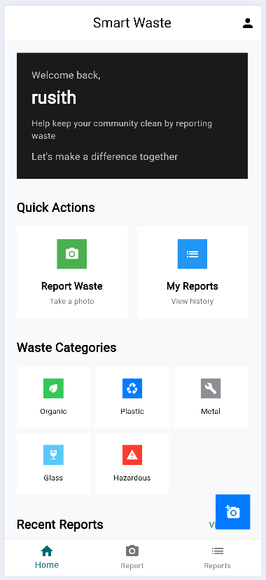
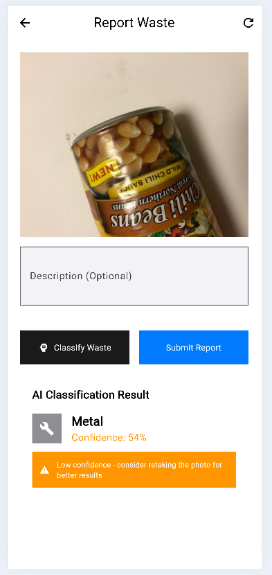

# Smart Waste Management System

A modern, AI-powered mobile application that revolutionizes waste management through intelligent classification and community engagement. Built with Flutter for mobile platforms and backed by Laravel REST API with machine learning capabilities.

## 🌟 **Key Features**

### 📱 **Mobile App (Flutter)**
- **Smart Camera Classification**: Capture waste photos with real-time AI-powered categorization
- **5 Waste Categories**: Organic, Plastic, Metal, Glass, Hazardous materials
- **Location-Based Reporting**: GPS integration for precise waste location tracking
- **Confidence Scoring**: ML confidence percentages for classification accuracy
- **User Authentication**: Secure login/signup with Laravel Sanctum
- **Report History**: Complete tracking of submitted waste reports
- **Modern UI**: shadcn/ui inspired flat design with Font Awesome icons
- **Cross-Platform**: iOS and Android support with responsive design

### 🤖 **AI & ML Integration**
- **MobileNetV2 Model**: Transfer learning for high-accuracy waste classification
- **FastAPI Backend**: Python-based ML service for real-time predictions
- **Confidence Metrics**: Uncertainty handling and recommendation system
- **Batch Processing**: Handle multiple images efficiently

### 🖥️ **Web Dashboard**
- **Admin Panel**: Manage waste reports and user accounts
- **Status Management**: Update report statuses (pending, assigned, collected)
- **ML Testing Interface**: Test classification models with uploaded images
- **Real-time Monitoring**: Live service health and model status

## 🏗️ **System Architecture**

```
┌─────────────────┐    ┌─────────────────┐    ┌─────────────────┐
│   Flutter App   │    │  Laravel API    │    │   FastAPI ML    │
│                 │    │                 │    │                 │
│ • Mobile UI     │◄──►│ • REST API      │◄──►│ • Classification│
│ • Camera        │    │ • Authentication │    │ • MobileNetV2  │
│ • GPS Location  │    │ • File Storage   │    │ • Confidence    │
│ • Report Mgmt   │    │ • ML Integration │    │ • Categories    │
└─────────────────┘    └─────────────────┘    └─────────────────┘
                              │
                              ▼
                       ┌─────────────────┐
                       │    MySQL DB     │
                       │                 │
                       │ • Users         │
                       │ • Reports       │
                       │ • Categories    │
                       └─────────────────┘
```

## 🚀 **Quick Start**

### Prerequisites
- Flutter SDK (3.0+)
- PHP 8.1+
- Python 3.8+
- MySQL 8.0+
- Composer & Node.js


## 📱 **Mobile App Screenshots**

### 🏠 **Home Page**


*Clean, modern interface with shadcn/ui design featuring waste categories, quick actions, and recent reports*

### 🤖 **Image Classification Page**


*AI-powered waste classification with real-time results, confidence scoring, and GPS location tracking*

## 🛠️ **Technology Stack**

### Frontend (Mobile)
- **Flutter**: Cross-platform mobile development
- **Dart**: Programming language
- **Font Awesome**: Modern icon library
- **Provider**: State management
- **Dio**: HTTP client for API calls
- **Image Picker**: Camera and gallery integration
- **Location**: GPS services

### Backend (API)
- **Laravel**: PHP framework for REST API
- **Sanctum**: Token-based authentication
- **MySQL**: Database management
- **Composer**: PHP dependency management

### AI/ML Service
- **FastAPI**: Python web framework
- **TensorFlow/Keras**: Machine learning framework
- **MobileNetV2**: Pre-trained CNN model
- **Pillow**: Image processing
- **NumPy**: Numerical computing

## 📊 **API Documentation**

### Authentication Endpoints
- `POST /api/register` - User registration
- `POST /api/login` - User login
- `POST /api/logout` - User logout
- `GET /api/user` - Get authenticated user

### Waste Report Endpoints
- `POST /api/report` - Submit waste report with image
- `GET /api/reports` - Get user's reports
- `GET /api/report/{id}` - Get specific report
- `PUT /api/report/{id}/status` - Update report status

### ML Service Endpoints
- `POST /ml/predict` - Single image classification
- `POST /ml/batch-predict` - Multiple image classification
- `GET /ml/categories` - Get waste categories
- `GET /ml/status` - Service health check

## 🎯 **Waste Categories**

| Category | Description | Examples |
|----------|-------------|----------|
| 🥬 **Organic** | Biodegradable waste | Food scraps, garden waste |
| 🥤 **Plastic** | Plastic materials | Bottles, containers, bags |
| 🔧 **Metal** | Metal objects | Cans, foil, scrap metal |
| 🍷 **Glass** | Glass containers | Bottles, jars, windows |
| ⚠️ **Hazardous** | Dangerous materials | Batteries, chemicals, electronics |

## 🔒 **Security Features**

- **JWT Authentication**: Secure token-based auth
- **Input Validation**: Comprehensive data validation
- **File Upload Security**: Type and size restrictions
- **CORS Protection**: Cross-origin resource sharing
- **Rate Limiting**: API request throttling
- **Environment Variables**: Sensitive data protection

## 📈 **Performance Metrics**

- **ML Accuracy**: 85%+ classification accuracy
- **Response Time**: <2 seconds for image processing
- **Mobile Performance**: Optimized for low-end devices
- **Offline Capability**: Basic functionality without network
- **Battery Efficient**: Minimal camera and GPS usage

